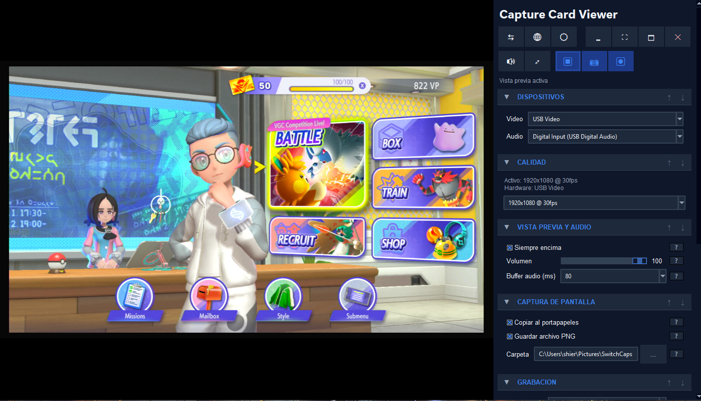

# CCV — Capture Card Viewer

**A tiny app for watching and recording your Switch, PS5, Xbox, or any USB capture card on Windows.**

No bloated launcher, no browser engine, no setup — just download the `.exe`, plug in your capture card, and play. Uses about 50 MB of RAM, opens in a couple of seconds.

## Why CCV

If you own a USB capture card, your two big options today are OBS (powerful but built for streamers, takes a while to learn and a lot of memory to run) or the bundled vendor app (often clunky, sometimes broken on modern Windows). CCV is the in-between: open the window, see your console, hit record when you want, close the window when you're done.

It's just a video preview + a record button. That's it. That's the pitch.

## Get it

**[⬇ Download `ccv.exe`](https://github.com/manucruzleiva/ccv/releases/latest)** — single file, ~135 MB, no installer needed. Everything required (including ffmpeg) is bundled inside.

Just save it anywhere (Desktop, Downloads, a USB stick…) and double-click to run.

> **First time?** Windows might warn that the app is "unrecognized" because it's not signed with a paid Microsoft certificate. Click **More info → Run anyway**. The source code is right here in this repo if you want to inspect it before running.

## What you can do

- **Watch your console** — embedded preview inside the app window, with audio. Smooth, low-latency.
- **Record gameplay** — hit ⏺ to start, hit it again to stop. Saves to your Videos folder.
- **Take screenshots** — hit 📷. Grabs straight from the live preview, no console interruption.
- **Focus mode** — double-click the video and the sidebar slides away so the gameplay fills the window.
- **Live volume / mute** — scroll wheel over the video to change volume, middle-click to mute.
- **Light or dark** — pick your theme from the System panel, switches instantly.
- **English / Español** — pick your language, also live.
- **Remembers everything** — your panel layout, window size, and settings survive across sessions.

## Shortcuts

**Keyboard**

| Key   | Action                                               |
|-------|------------------------------------------------------|
| `F11` | Toggle fullscreen                                    |
| `F12` | Hide window to tray                                  |
| `Esc` | Exit focus mode (and exit fullscreen if active)      |

**Mouse — over the video**

| Gesture           | Action                                         |
|-------------------|------------------------------------------------|
| Double-click      | Toggle focus mode (sidebar slides out)         |
| Scroll wheel      | Volume ±5% per step                            |
| Middle-click      | Toggle mute                                    |

**Mouse — over the action buttons**

| Gesture                   | Action                            |
|---------------------------|-----------------------------------|
| `Ctrl` + click on `📷`    | Open the screenshots folder       |
| `Ctrl` + click on `⏺`     | Open the recordings folder        |

## I have a problem

- **No video shows up** — make sure your capture card is plugged in *before* opening CCV, and pick the right device in the **Capture** panel dropdown.
- **No sound** — same deal, pick the audio device in the **Capture** panel. Some cards expose video and audio as separate USB devices.
- **Recording is choppy** — the **Diagnostics** panel inside the app will tell you if your settings are too heavy for your hardware.
- **Something else** — open an [issue](https://github.com/manucruzleiva/ccv/issues) and tell me what happened.

## Like it?

If CCV saves you time, you can [sponsor the project on GitHub](https://github.com/sponsors/manucruzleiva). Totally optional, very appreciated.

## Tech / contributing

If you want to look under the hood, build from source, contribute, or understand how the embedded preview works, see **[DEVELOPMENT.md](DEVELOPMENT.md)**.

## License

MIT — see [LICENSE](LICENSE). Free to use, modify, share.
